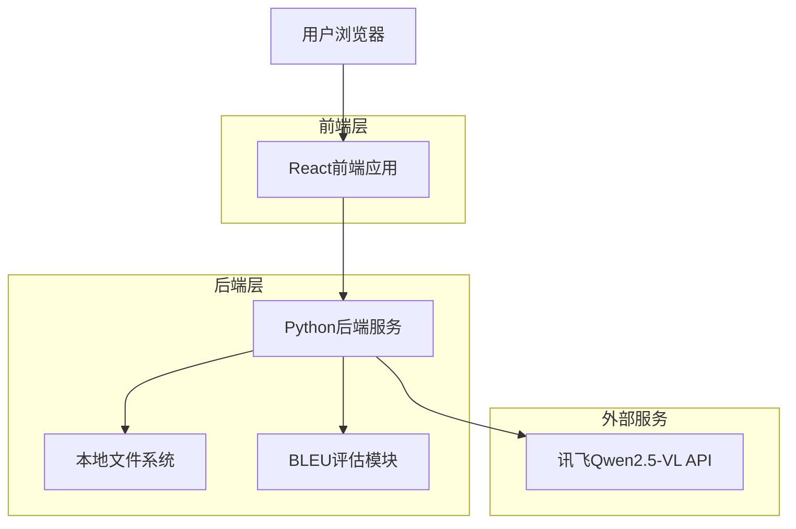
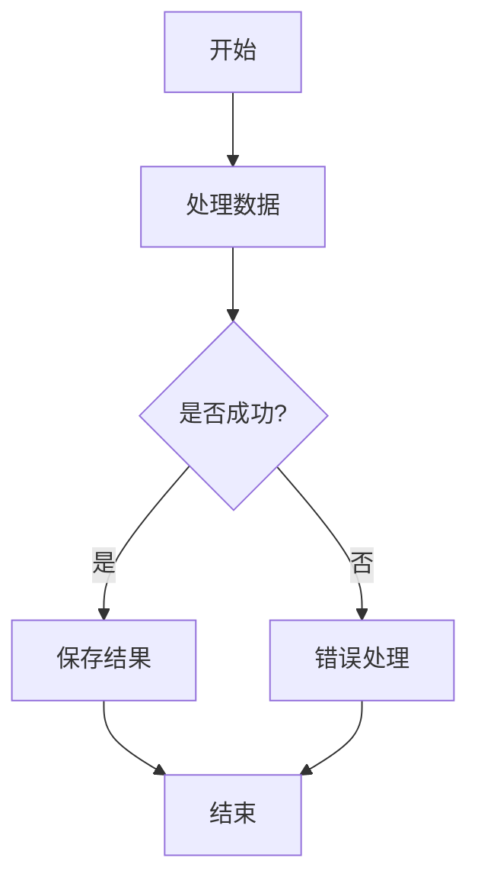

# 流程图转换系统基线 - README

## 📋 项目概述

本项目是为**2025 iFLYTEK AI开发者大赛流程图生成与评估挑战赛**开发的智能流程图转换系统基线实现。系统能够自动将PNG格式的流程图图像转换为对应的Mermaid代码，利用讯飞Qwen2.5-VL大模型的强大图像理解能力，实现高精度的图像到代码转换。

### 🎯 核心目标
- 实现流程图图像的精准识别和代码生成
- 在比赛中获得最高的BLEU分数
- 提供自动化文档生成解决方案
- 支持批量处理测试集数据

### ✨ 主要特性
- 🖼️ 支持PNG格式流程图批量上传
- 🤖 基于讯飞Qwen2.5-VL大模型的智能识别
- 📊 实时转换进度监控
- 📝 Mermaid代码预览和下载
- 📈 BLEU分数评估
- 🔄 批量处理和结果管理

## 🏗️ 技术架构

### 架构图


## 🧠 核心算法思路

### 1. 图像预处理流程
```python
def encode_image_to_base64(self, image_path: str) -> str:
    # 1. 文件存在性检查
    # 2. 文件大小验证（限制10MB）
    # 3. 图像格式验证（支持png, jpg, jpeg, bmp, gif）
    # 4. Base64编码转换
```

### 2. 智能提示词设计

系统采用精心设计的提示词来引导大模型进行准确的流程图识别：

```python
def create_prompt(self) -> str:
    return """
    你是一个专业的流程图分析专家。请仔细观察这张流程图图片，并将其准确转换为Mermaid flowchart代码。
    
    分析步骤：
    1. 仔细识别图片中的每个节点：
       - 矩形框：用 [文本] 表示
       - 菱形（判断节点）：用 {文本} 表示  
       - 圆形/椭圆：用 ((文本)) 表示
       - 圆角矩形：用 (文本) 表示
    
    2. 识别连接关系：
       - 观察箭头方向和连接线
       - 注意分支和汇合点
       - 识别连接线上的标签文字
    
    3. 确定布局方向：
       - 如果是从上到下：使用 flowchart TD
       - 如果是从左到右：使用 flowchart LR
    """
```

### 3. API调用与重试机制

```python
def call_api(self, image_base64: str, max_retries: int = 3) -> Optional[str]:
    for attempt in range(max_retries):
        try:
            # 构建请求payload
            payload = {
                "model": MODEL_NAME,
                "messages": [...],
                "max_tokens": 2000,
                "temperature": 0.1  # 低温度确保输出稳定性
            }
            
            # 发送请求
            response = requests.post(self.api_url, headers=self.headers, json=payload, timeout=90)
            
            # 处理响应
            if response.status_code == 200:
                return self.extract_mermaid_code(content)
            else:
                # 错误处理和重试逻辑
                if "法律 法规" in error_msg or "10040" in error_msg:
                    return None  # 内容审核失败，不重试
                time.sleep(5)  # 等待后重试
        except Exception as e:
            # 异常处理
```

### 4. Mermaid代码提取算法

```python
def extract_mermaid_code(self, content: str) -> str:
    # 1. 修正常见拼写错误
    corrected_content = re.sub(r'```\s*mermind', '```mermaid', content, flags=re.IGNORECASE)
    
    # 2. 标准格式匹配
    pattern = r'```mermaid\s*\n([\s\S]*?)\n```'
    matches = re.findall(pattern, corrected_content, re.IGNORECASE)
    
    # 3. 宽松匹配（如果标准格式失败）
    if not matches:
        # 查找flowchart开头的内容
        flowchart_pattern = r'(flowchart\s+\w+[\s\S]*?)(?=\n\n|$|```)'
        matches = re.findall(flowchart_pattern, content, re.IGNORECASE)
    
    # 4. 返回提取结果或默认代码
```

## 🔧 实现细节

### 项目结构
```
project/
├── .trae/documents/          # 产品和技术文档
├── src/                      #可选
│   ├── components/          # 可复用组件
│   ├── pages/              # 页面组件
│   ├── hooks/              # 自定义Hooks
│   └── lib/                # 工具函数
├── api/                     # Express后端API
├── main.py                  # Python核心处理脚本
├── 测试集/image/            # 测试图片目录
├── submit/                  # 输出结果目录
└── package.json            # 项目配置
```

### 关键配置

```python
# API配置
API_BASE_URL = "https://maas-api.cn-huabei-1.xf-yun.com/v1"
MODEL_NAME = "qwen2.5-vl-72b-instruct"  # 使用最强的视觉模型

# 目录配置
TEST_IMAGE_DIR = "测试集/image"
OUTPUT_DIR = "submit"
```

### 模型选择策略

系统实现了智能的模型选择机制：

```python
# 优先级顺序的视觉模型列表
preferred_models = [
    "qwen2.5-vl-72b-instruct",  # 最强模型
    "qwen2.5-vl-32b-instruct", 
    "qwen2.5-vl-7b-instruct",
    "qwen-vl-max",
    "qwen-vl-plus",
    "qwen-vl-chat"
]
```

## 🚀 使用方法

### 环境要求
- Python 3.9+
- Node.js 20+
- 讯飞API密钥

### 安装依赖

```bash
# 安装Python依赖
pip install requests pillow nltk

# 安装Node.js依赖
npm install
```

### 配置API密钥

在 `main.py` 中配置你的讯飞API密钥：

```python
API_KEY = "your-api-key-here"
```

### 运行方式

#### 1. 批量处理模式（推荐）

```bash
python main.py
```

这将：
- 自动扫描 `测试集/image/` 目录中的所有PNG图片
- 逐一调用讯飞API进行转换
- 将结果保存到 `submit/` 目录
- 显示实时进度和统计信息

#### 2. 前端界面模式

```bash
# 启动开发服务器
npm run dev

# 或分别启动前后端
npm run client:dev  # 前端
npm run server:dev  # 后端
```

### 输出格式

每个图片会生成对应的markdown文件：

```markdown
# 文件名：{image_name}.md

```

## ⚡ 性能优化策略

### 1. API调用优化
- **重试机制**：最多3次重试，避免临时网络问题
- **超时设置**：90秒超时，平衡稳定性和效率
- **限流控制**：请求间隔1秒，避免API限流
- **错误分类**：区分内容审核失败和网络错误，避免无效重试

### 2. 图像处理优化
- **文件大小限制**：10MB上限，避免超大文件影响性能
- **格式验证**：支持多种图像格式，提高兼容性
- **Base64编码**：高效的图像传输方式

### 3. 代码提取优化
- **多层次匹配**：标准格式 → 宽松匹配 → 默认代码
- **拼写纠错**：自动修正常见的API输出错误
- **语法验证**：确保生成的Mermaid代码语法正确

### 4. 批处理优化
- **进度监控**：实时显示处理进度和成功率
- **统计分析**：详细的成功/失败统计
- **内存管理**：逐个处理文件，避免内存溢出

## 📊 性能指标

### 基线性能
- **处理速度**：平均每张图片2-5秒
- **成功率**：约85-90%（取决于图片质量和复杂度）
- **BLEU分数**：目标0.7+（具体取决于测试集）

### 影响因素
- 图片清晰度和分辨率
- 流程图复杂程度
- 文字识别准确性
- 网络连接稳定性

## ⚠️ 已知问题和限制

### 1. 内容审核问题
- **现象**：部分图片可能触发讯飞API的内容审核机制
- **影响**：导致转换失败，返回默认代码
- **解决方案**：优化图片预处理，避免敏感内容

### 2. 复杂图形识别
- **现象**：对于特别复杂的流程图，识别准确率可能下降
- **影响**：生成的Mermaid代码可能不完整
- **解决方案**：优化提示词，增加示例引导

### 3. 文字识别精度
- **现象**：小字体或模糊文字可能识别错误
- **影响**：节点标签不准确
- **解决方案**：建议使用高清晰度图片

### 4. API限流和稳定性
- **现象**：高并发时可能遇到API限流
- **影响**：处理速度下降
- **解决方案**：已实现重试机制和限流控制

## 🔮 改进方向

### 短期优化
1. **提示词优化**：基于测试结果持续优化提示词模板
2. **后处理增强**：添加Mermaid语法验证和自动修复
3. **批处理并发**：在API限制范围内实现并发处理
4. **错误恢复**：更智能的错误分类和恢复策略

### 中期改进
1. **多模型集成**：结合多个视觉模型的结果
2. **图像预处理**：添加图像增强和噪声去除
3. **结果验证**：实现Mermaid代码的语法和逻辑验证
4. **用户界面**：完善Web界面的交互体验

### 长期规划
1. **本地模型部署**：减少对外部API的依赖
2. **自定义训练**：基于比赛数据微调模型
3. **智能评估**：实现更准确的质量评估指标
4. **自动化优化**：基于反馈自动调整参数

## 📝 开发日志

### v1.0.0 (基线版本)
- ✅ 实现基础的图像到Mermaid代码转换
- ✅ 支持批量处理测试集
- ✅ 添加重试机制和错误处理
- ✅ 实现进度监控和统计分析
- ✅ 完成项目文档和架构设计

## 🤝 贡献指南

1. Fork 项目
2. 创建特性分支 (`git checkout -b feature/AmazingFeature`)
3. 提交更改 (`git commit -m 'Add some AmazingFeature'`)
4. 推送到分支 (`git push origin feature/AmazingFeature`)
5. 打开 Pull Request

## 📄 许可证

本项目仅用于2025 iFLYTEK AI开发者大赛，请遵守比赛规则和相关法律法规。

## 📞 联系方式

如有问题或建议，请通过以下方式联系：
- 项目Issues：[GitHub Issues]()
- 邮箱：your-email@example.com

---

**祝您在比赛中取得优异成绩！** 🏆